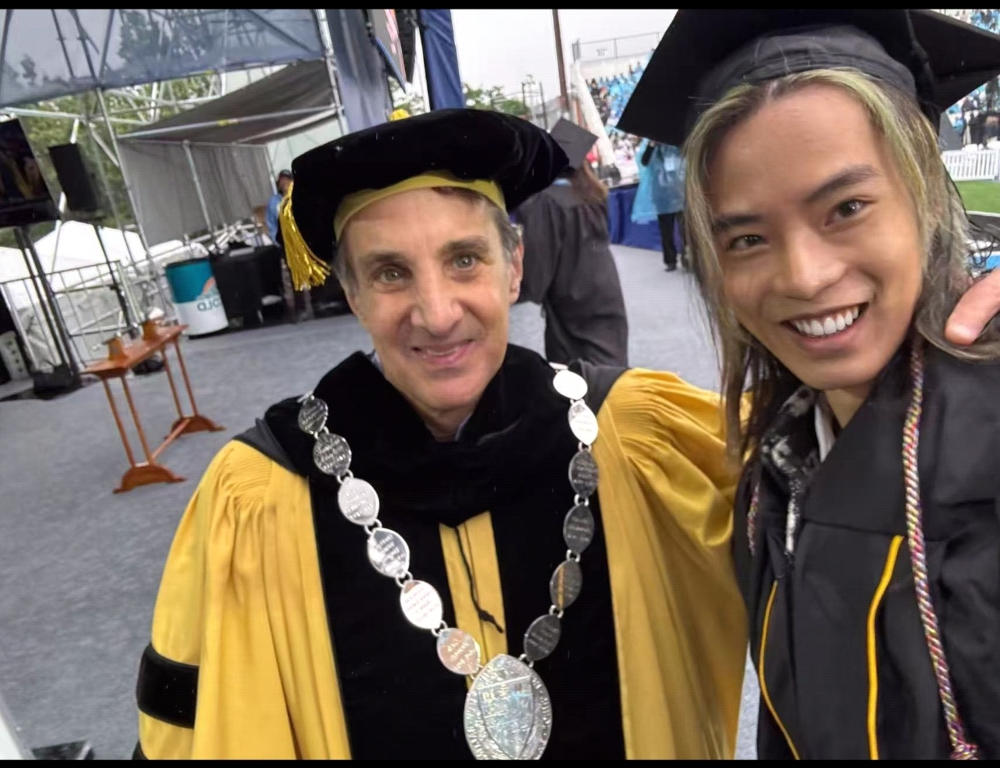
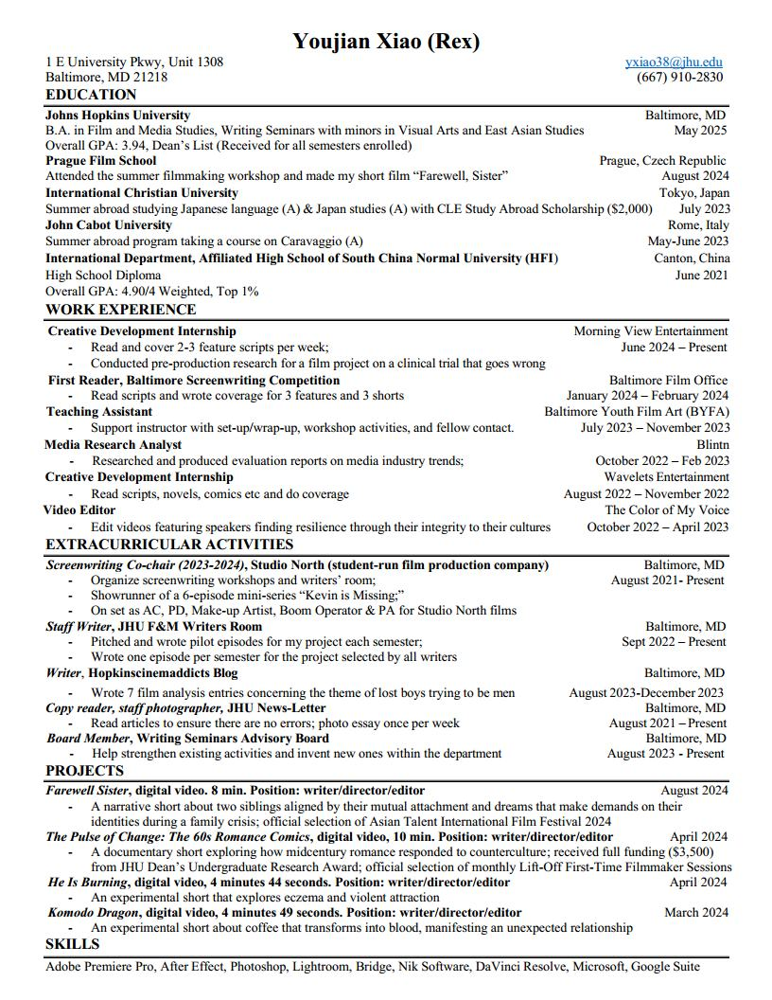

# Rex (Youjian) Xiao is a senior at Johns Hopkins University, double majoring in
Film and Media Studies (Screenwriting Track) and Writing Seminars with
minors in Visual Arts and East Asian Studies. Originally from Canton, China,
Rex believes that storytelling has the power to transcend regional and
cultural boundaries. A writer, filmmaker, and part-time photographer, Rex
wants to explore shared themes of the humanities, such as love； anger,
shame, and memory, through his works and, by doing so, to understand
himself and the world better. His writings have appeared in the student
literary magazine The Warehouse; his visual artworks have been featured in
the Decagon Gallery, PJAS magazine, Out of the Blue Jay, and elsewhere. His
films have been selected by the 2024 Asian Talent International Film Festival
(won the Best Student Film Award with Outstanding Achievement mention),
the Direct Monthly Online Film Festival, and the monthly Lift-Off First-Time
Filmmaker Sessions.

